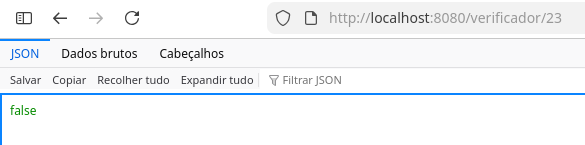
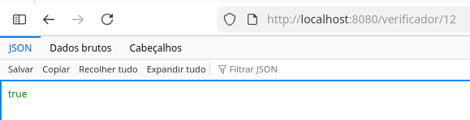
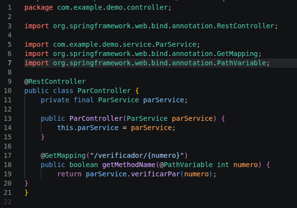
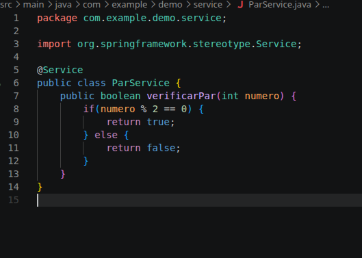
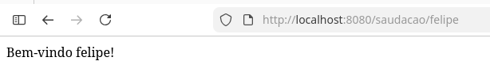
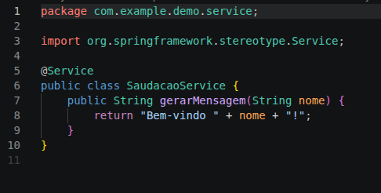
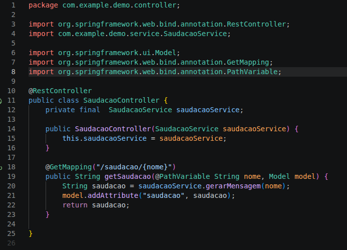

# Teste aplicação de Controller e Services

## Objetivo
Aplicar na prática conhecimento de controller e service java.

## Exemplos

Mensagem de saudação;
Verificador de par ou impar;
Conversor de Fahrenheit para Celsius;
Conversor de Dólar para Real, ou Real para Dólar;
Contador de Caracteres;

# Prints

## Telas

